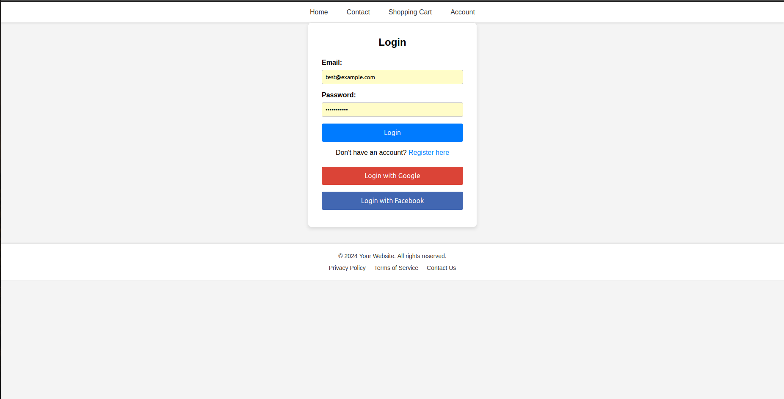
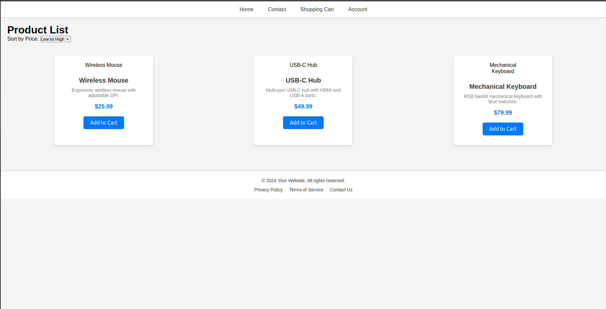
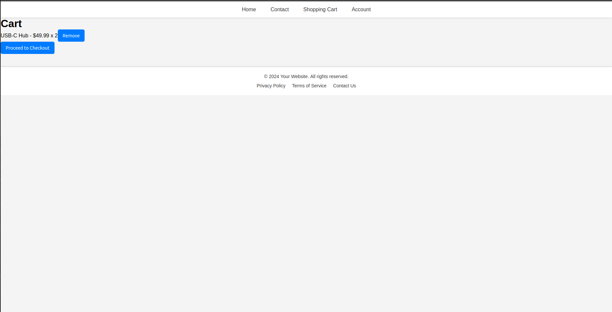
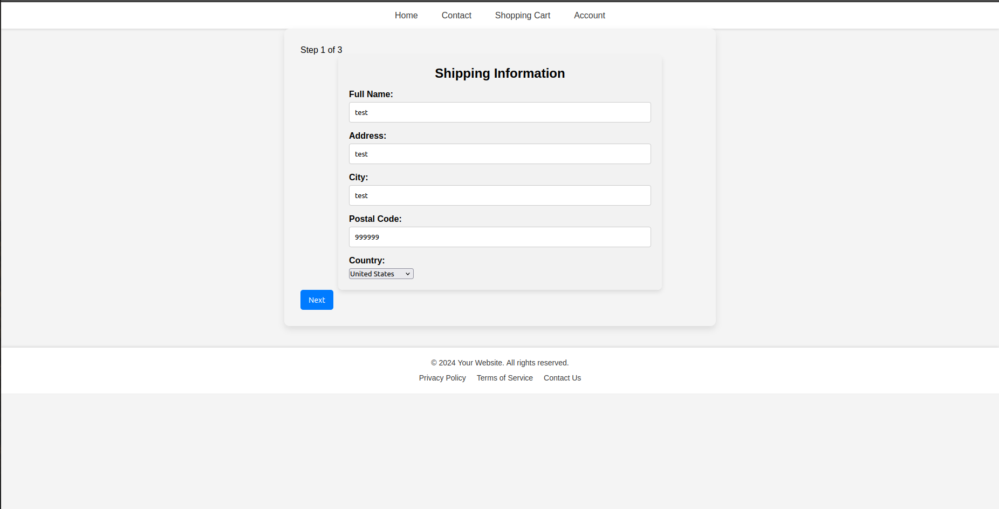
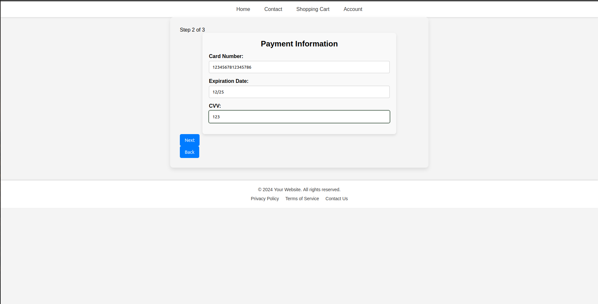
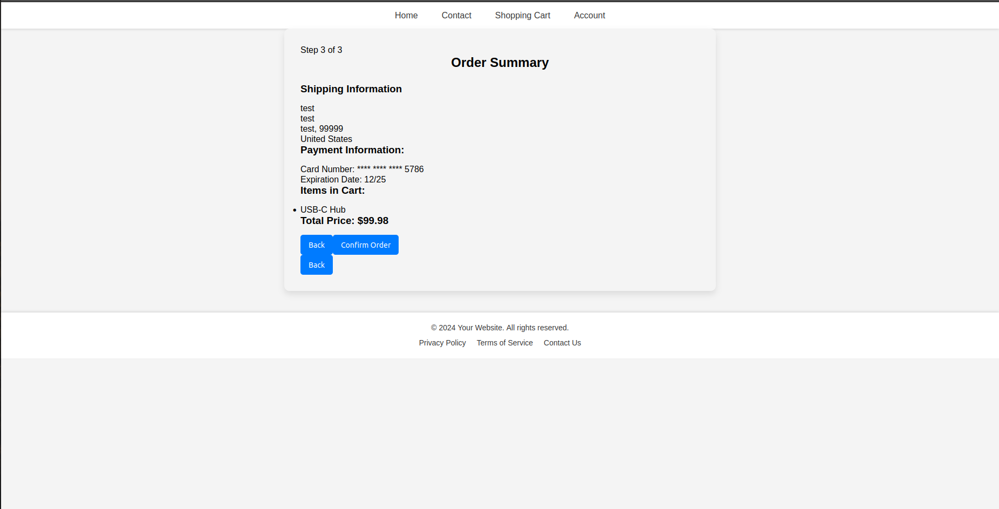
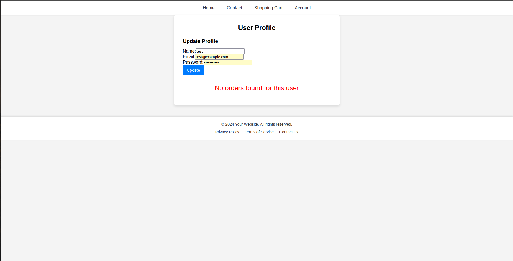
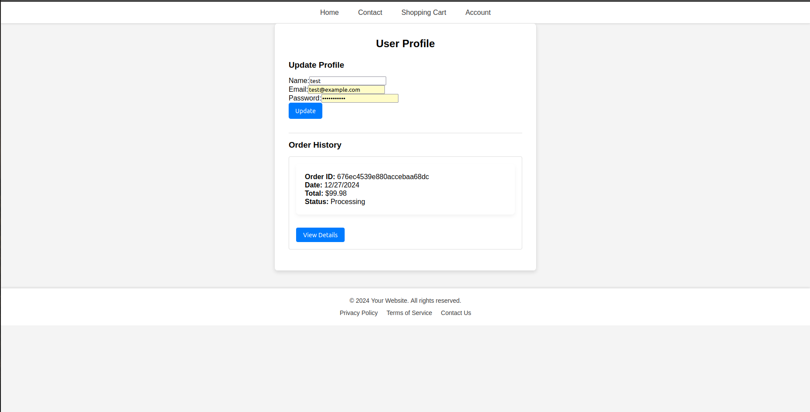

E-commerce Platform
Description

An advanced MERN stack e-commerce platform designed for seamless online shopping. It includes features like user authentication, product browsing, cart management, and secure order processing. This project demonstrates the power of the MERN stack for building full-stack web applications.
Features

    User Authentication: Register, and login functionality.
    Product Browsing: Dynamic product catalog with search and filter capabilities.
    Shopping Cart: Add, remove, and update items in the cart.
    Order Management: Checkout and order tracking.
    Admin Dashboard: Manage products, users, and orders.
    RESTful APIs: Robust API design for efficient data handling.

Technologies Used

    Frontend: React.js with React Router for navigation
    Backend: Express.js for server-side logic
    Database: MongoDB for data persistence
    Runtime Environment: Node.js
    Styling: CSS/Bootstrap
    Additional: Redux for state management, JWT for authentication, and Axios for HTTP requests.

Installation and Setup
Prerequisites

    Node.js installed
    MongoDB installed locally or access to MongoDB Atlas

Steps

    Clone the repository:

git clone https://github.com/AzerG256/E-commerce.git
cd E-commerce

Install dependencies:
 
 Backend
  
    npm install

 Frontend:

    cd e-commerce
    npm install

Set up environment variables:

    Create a .env file in the root directory.
    Add the following variables:

    PORT=5000
    MONGO_URI=your_mongo_connection_string
    JWT_SECRET=your_jwt_secret

Run the application:

  Start the backend server:
  
        cd e-commerce/server
        node server.js

  Start the frontend:

        cd e-commerce
        npm start

    The application will be available at http://localhost:3000.

Usage

    Navigate to the homepage to explore products.
    Register or login to start shopping.
    Add products to your cart and proceed to checkout.
    Admins can manage products, users, and orders through the dashboard.

Folder Structure

E-commerce/
├── src/components/         # React frontend
├── server/models/          # MongoDB schemas and models
├── server/routes/          # API endpoints
├── server/controllers/     # Backend logic
├── server/middleware/      # Middleware for authentication
├── server/utils/           # Helper functions
├── server/server.js        # Backend entry point

Screenshots

    Registration Page:
    
    Login Page:
    
    Homepage:
    
    Cart Page:
    

    order payment and validation:
    
    
    
    
    UserProfile Page:
    
    OrderHistory Page:
    

Contributing

Contributions are welcome! To contribute:

    Fork this repository.
    Create a new branch for your feature or bugfix.
    Commit your changes.
    Open a pull request.

License

This project is licensed under the MIT License.
